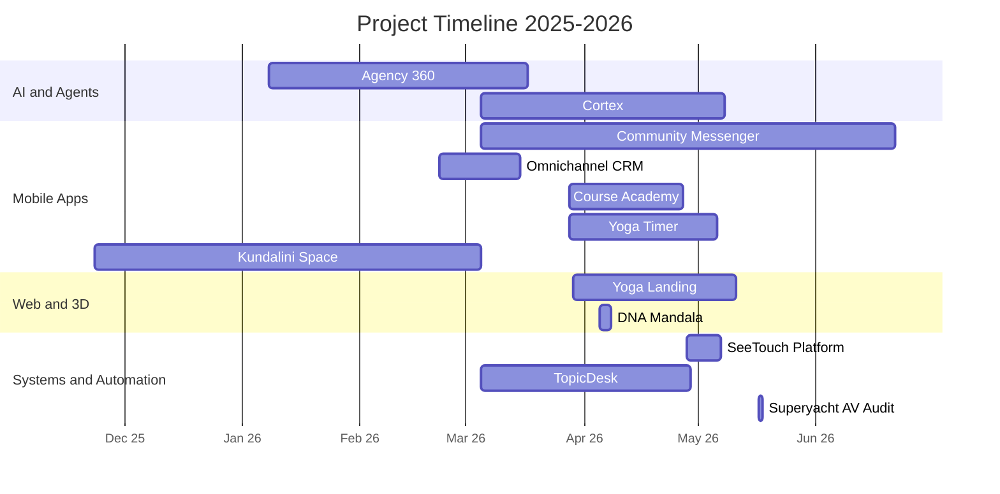

<!-- This file is the GitHub Profile README. Publish it to a public repo named exactly `SeeTouch/SeeTouch`. -->

<h1 align="center">Hi, I'm Dmitry Ryzhkov 👋</h1>

  <b>AI Automation Architect</b> · IoT Systems Engineer · RAG & Agentic Workflows

  
  
  
  

---

**Senior systems architect with 20+ years engineering complex hardware ecosystems**, now building enterprise-grade **AI automation** and **IoT** solutions. I bridge physical infrastructure — smart home, pro-AV, control systems — and cognitive intelligence: **LLMs, multi-agent systems, and RAG**.

My background is deliberately unusual. Over two decades I walked the full path — from low-voltage (ELV) installer, to systems designer, to the engineer sitting across the table from the client — delivering **15+ superyachts** (the largest a **72 m** vessel I automated in 2026) and elite residences: hotels, villas, and apartments across **Russia, Latvia, Spain, Italy, France, Germany, the UK and Malta**. That means I own the **complete cycle — from a client's idea to a turnkey, working system.** Integrating Crestron, KNX, AMX, DSP audio and matrix video at that level gives me a systems-level instinct I now apply to software: I don't just write code, I unify hardware, CRM data, and AI logic into seamless, autonomous ecosystems. The projects below span mobile, web, AI agents, and automation — from a 700-commit Flutter messenger to a multi-agent LangGraph backend to an edge-first smart-home platform.

Most of my work lives in **private client repositories**, so this profile is a curated set of **case studies**. Each one documents the problem, architecture, tech stack, and the engineering decisions behind it — with **real metrics pulled straight from git history** (commits, active development days, lines of code, test counts). Code samples and live demos are available on request.

## 🧰 Tech I work with

 

 

## 📊 By the numbers

<table>
<tr>
  <td align="center"><b>12</b> shipped projects</td>
  <td align="center"><b>~1,800+</b> commits</td>
  <td align="center"><b>~250k+</b> lines authored</td>
  <td align="center"><b>~2,000+</b> automated tests</td>
  <td align="center"><b>6</b> languages</td>
</tr>
</table>

Aggregated across the case studies below. Every figure is verifiable from each project's git history.

## 🗓️ Project timeline

## 📦 Selected projects

> Each title links to a full case study.

### 🤖 AI & Agents
| Project | What it is | Stack | Scale |
|---|---|---|---|
| **[Agency 360](case-studies/agency-360-langchain.md)** | Multi-agent LangGraph backend automating hospitality recruitment onboarding | Python · LangGraph · FastAPI | ~12k LOC · 197 commits · 4 agents |
| **[Cortex](case-studies/cortex.md)** | Turns PDFs & scanned books into RAG-ready knowledge bases via Gemini vision | React · TS · Google Gemini | ~9.1k LOC · 128 tests |

### 📱 Mobile (Flutter)
| Project | What it is | Stack | Scale |
|---|---|---|---|
| **[Women's Community Messenger](case-studies/community-messenger.md)** | Local-first, offline-capable women's community messenger *(NDA)* | Flutter · Drift · Supabase | ~59k LOC · 478 tests · 723 commits |
| **[Omnichannel Messaging CRM](case-studies/omnichannel-crm.md)** | Unifies Telegram/WhatsApp/email into one inbox for a yoga studio | Flutter · Supabase Edge · TS | ~13k LOC · offline-first |
| **[Online Video-Course Academy](case-studies/video-course-academy.md)** | Subscription video-course platform across web & mobile | Flutter · Next.js · Supabase | ~18k LOC · monorepo |
| **[Yoga Timer](case-studies/yoga-timer.md)** | iOS-first guided yoga & meditation app with audio sessions | Flutter · Drift · Swift plugin | ~14k LOC · 129 tests |
| **[Kundalini Space](case-studies/kundalini-space.md)** | Telegram Mini App delivering subscription-gated practice videos | Flutter · FastAPI · Whisper | ~8.4k LOC · ML pipeline |

### 🌐 Web & 3D
| Project | What it is | Stack | Scale |
|---|---|---|---|
| **[DNA Mandala](case-studies/dna-mandala.md)** | Real-time 3D system mapping birth charts to geometry & generative sound | React Three Fiber · Three.js · Tone.js | ~7k LOC · 161 tests |
| **[Multilingual Yoga Landing](case-studies/yoga-landing.md)** | Multilingual, CMS-driven marketing site on the edge | Astro · React · Keystatic · Cloudflare | ~4.5k LOC · i18n |

### 🏗️ Systems & Automation
| Project | What it is | Stack | Scale |
|---|---|---|---|
| **[SeeTouch](case-studies/seetouch-mation-system.md)** | Open-core, edge-first smart-home platform for pro AV/KNX/Modbus | TypeScript · monorepo · WebSocket | ~81k LOC · 1,058 tests |
| **[TopicDesk](case-studies/topic-desk.md)** | Omnichannel support desk & CRM that lives inside Telegram topics | grammY · Deno · Supabase | ~43k LOC · 117 tests |
| **[Superyacht AV Audit](case-studies/superyacht-av-audit.md)** | As-built AV/automation/network audit of a ~50 m superyacht | Systems documentation · draw.io | 114 docs · 25 zones |

## 🧭 Experience

**Independent AI Solutions Architect & Developer** — Remote / International · 2022–Present
End-to-end digital products for business clients: omni-channel CRM automation (WhatsApp/Telegram → CRM pipelines), advanced RAG knowledge bases, rapid MVP prototyping, and cross-platform Flutter apps.

**Chief Engineer (contract)** — Luxury Superyacht (~50 m), Italy · 2024–2025
Led the complete digital refit — convergence of IT networks, AV systems, and automation logic — with fault-tolerant architectures running 24/7 in demanding marine conditions.

**Senior Smart Systems Integrator & Consultant** — Russia · Latvia · Spain · Italy · France · Germany · UK · Malta · 2010–2022
Full-cycle delivery of **50+ premium automation projects** — superyachts, hotels, villas, and luxury residences. Large-scale multi-room and club/PA audio (BSS DSP, BLU link), high-bandwidth video distribution (matrix / HDMI-over-IP), home cinema (Dolby Atmos / DTS:X), and custom protocol-bridging drivers — owning the path from ELV installation through systems design to client-facing handover.

**M.Sc. Telecommunications** — Saint Petersburg State University of Telecommunications · 2007
Multimedia technologies, signal processing, radio communication.

## 📫 Get in touch

- **Email:** [dmitry_r@me.com](mailto:dmitry_r@me.com)
- **GitHub:** [@SeeTouch](https://github.com/SeeTouch)
- Code walkthroughs and live demos of any project above are available on request.

Repositories are private to protect client work. This profile favors verifiable engineering detail over a green contribution graph.
