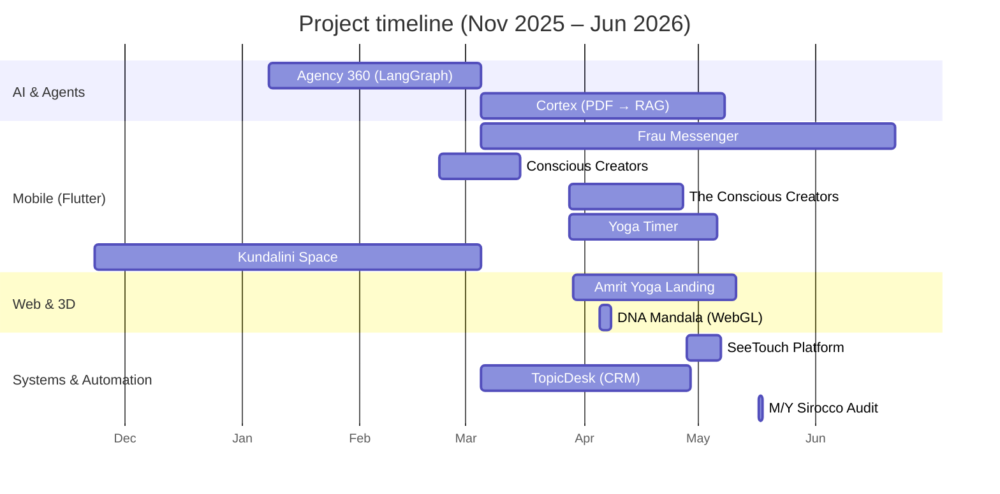

<!-- This file is the GitHub Profile README. Publish it to a public repo named exactly `SeeTouch/SeeTouch`. -->

<h1 align="center">Hi, I'm Dmitry Ryzhkov 👋</h1>

  <b>Full-stack & systems engineer</b> — AI agents · Flutter apps · pro-AV & home-automation platforms

  
  

---

I design and ship end-to-end products across **mobile, web, backend, AI agents, and physical automation** — from a 700-commit Flutter messenger to a multi-agent LangGraph recruitment backend to an edge-first smart-home platform for professional AV/KNX/Modbus integrators.

Most of my work lives in **private client repositories**, so this profile is a curated set of **case studies**. Each one documents the problem, architecture, tech stack, and the engineering decisions behind it — with **real metrics pulled straight from git history** (commits, active development days, lines of code, test counts). Code samples and live demos are available on request.

## 🧰 Tech I work with

 

## 📊 By the numbers

<table>
<tr>
  <td align="center"><b>12</b> shipped projects</td>
  <td align="center"><b>~1,600+</b> commits</td>
  <td align="center"><b>~250k+</b> lines authored</td>
  <td align="center"><b>~2,000+</b> automated tests</td>
  <td align="center"><b>6</b> languages</td>
</tr>
</table>

Aggregated across the case studies below. Every figure is verifiable from each project's git history.

## 🗓️ Project timeline

## 📦 Selected projects

> Each title links to a full case study.

### 🤖 AI & Agents
| Project | What it is | Stack | Scale |
|---|---|---|---|
| **[Agency 360](case-studies/agency-360-langchain.md)** | Multi-agent LangGraph backend automating hospitality recruitment onboarding | Python · LangGraph · async | ~10.8k LOC · multi-agent |
| **[Cortex](case-studies/cortex.md)** | Turns PDFs & scanned books into RAG-ready knowledge bases via Gemini vision | React · TS · Google Gemini | ~9.1k LOC · 128 tests |

### 📱 Mobile (Flutter)
| Project | What it is | Stack | Scale |
|---|---|---|---|
| **[Frau Messenger](case-studies/frau-messenger.md)** | Local-first, offline-capable messenger & community platform | Flutter · Drift · Supabase | ~59k LOC · 478 tests · 723 commits |
| **[Conscious Creators](case-studies/conscious-creators.md)** | Omnichannel messaging CRM (Telegram/WhatsApp/email → one inbox) | Flutter · Supabase Edge · TS | ~13k LOC · offline-first |
| **[The Conscious Creators Academy](case-studies/the-conscious-creators.md)** | Subscription video-course platform across web & mobile | Flutter · Next.js · Supabase | ~18k LOC · monorepo |
| **[Yoga Timer](case-studies/yoga-timer.md)** | iOS-first guided yoga & meditation app with audio sessions | Flutter · Drift · Swift plugin | ~14k LOC · 129 tests |
| **[Kundalini Space](case-studies/kundalini-space.md)** | Telegram Mini App delivering subscription-gated practice videos | Flutter · FastAPI · Whisper | ~8.4k LOC · ML pipeline |

### 🌐 Web & 3D
| Project | What it is | Stack | Scale |
|---|---|---|---|
| **[DNA Mandala](case-studies/dna-mandala.md)** | Real-time 3D system mapping birth charts to geometry & generative sound | React Three Fiber · Three.js · Tone.js | ~7k LOC · 161 tests |
| **[Amrit Yoga Landing](case-studies/amrit-yoga-landing.md)** | Multilingual, CMS-driven marketing site on the edge | Astro · React · Keystatic · Cloudflare | ~4.5k LOC · i18n |

### 🏗️ Systems & Automation
| Project | What it is | Stack | Scale |
|---|---|---|---|
| **[SeeTouch](case-studies/seetouch-mation-system.md)** | Open-core, edge-first smart-home platform for pro AV/KNX/Modbus | TypeScript · monorepo · WebSocket | ~81k LOC · 1,058 tests |
| **[TopicDesk](case-studies/topic-desk.md)** | Omnichannel support desk & CRM that lives inside Telegram topics | grammY · Deno · Supabase | ~43k LOC · 117 tests |
| **[M/Y Sirocco Audit](case-studies/my-sirocco.md)** | As-built AV/automation/network audit of a 47 m superyacht | Systems documentation · draw.io | 114 docs · 25 zones |

## 📫 Get in touch

- **Email:** [dmitry_r@me.com](mailto:dmitry_r@me.com)
- **GitHub:** [@SeeTouch](https://github.com/SeeTouch)
- Code walkthroughs and live demos of any project above are available on request.

Repositories are private to protect client work. This profile favors verifiable engineering detail over a green contribution graph.
